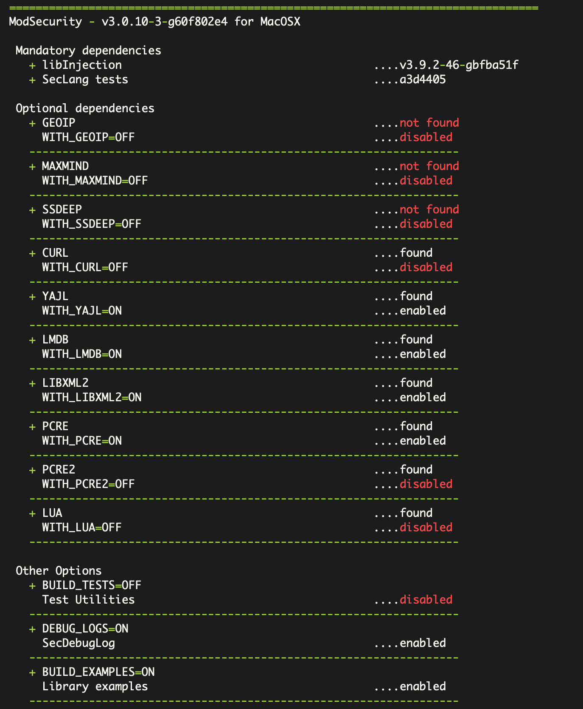

<h1 align="center">ModSecurity-CMake</h1>

## 🎯 About

[ModSecurity](https://github.com/SpiderLabs/ModSecurity) is an open source, cross-platform web application firewall (WAF) engine built using the automake tools. For more information, please refer to <https://github.com/SpiderLabs/ModSecurity/blob/v3/master/README.md>.

This repository is forked from the modsecurity v3/master and uses cmake for building.

## ✨ Features

This repository

* ✔️ provides a cmake build flow.
* ✔️ provides more friendly build prompts.
* ✔️ uses vcpkg for dependency management.

## 🛠 Build

### automake

```shell
$ ./build.sh
$ ./configure
$ make
```

For more detail, please refer to [compilation recipes](https://github.com/SpiderLabs/ModSecurity/wiki/Compilation-recipes).

### cmake

```shell
# path to repo
$ cp others/libinject-cmake/CMakeLists.txt others/libinjection
$ mkdir build
$ cd build
# no dependencies
$ cmake ..
# You can see the output information, but the build will most likely fail because missing some dependent packages.

# Use vcpkg:
# For building modsecurity, option WITH_PCRE is required. 
# Building examples is default ON. Then options WITH_YAJL,WITH_LMDB and WITH_LIBXML2 are required.
# build with pcre yajl lmdb libxml2 dependencies and support debug log:
cmake .. -DVCPKG_MANIFEST_MODE=ON -DCMAKE_TOOLCHAIN_FILE=$HOME/vcpkg/scripts/buildsystems/vcpkg.cmake -DWITH_PCRE=ON -DWITH_YAJL=ON -DWITH_LMDB=ON -DWITH_LIBXML2=ON -DDEBUG_LOGS=ON -GNinja

$ cmake --build .
```



## 🚀 TODO

* find geoip/maxmind module to cmake build.
* find ssdeep module to cmake build.
* add CMakeLists.txt for building test directory.
* add CMakeLists.txt for building tools directory.
* add cmake install configuration.
* add cmake export configuration.

